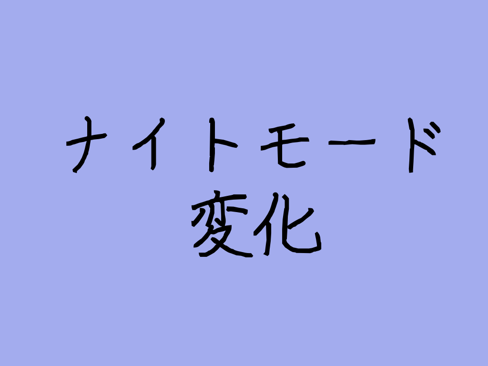
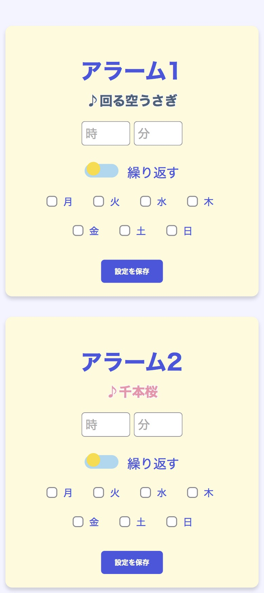
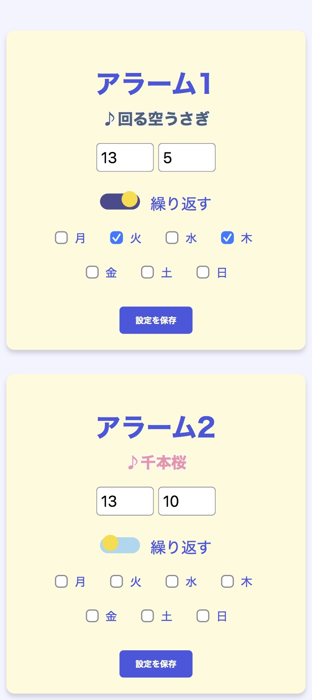
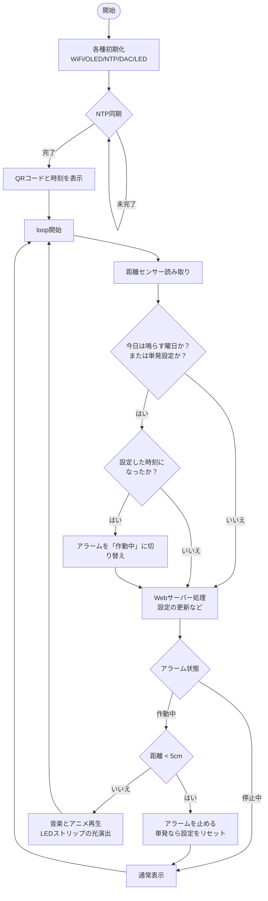

# 卒業制作：アニメーション付きアラーム時計
## 概要

Web上で設定した時刻にアラームとアニメーションが流れる時計

アラームの動作

## 主な機能

**OLED画面表示**
* 設定ページへのQRコード
* 年月日、曜日、時間
* ナイトモード
  * 指定した時間帯は、ディスプレイのコントラストを下げて眩しさを抑える
  * 深夜帯はディスプレイを消灯し安眠をサポートし、朝になったら自動で点灯する
  
  ディスプレイの表示
  
  
  QRコードが読み込めている様子
  

  ナイトモードの変化
  

**アラーム機能**
* オーディオモジュールとスピーカーからはメロディを再生
* OLED上にアラームと対応したアニメーションが流れる
* LEDストリップが光る
* 超音波センサーから5㎝以内に手をかざすと止まる

**Webページ**
* アラームを鳴らす時間、繰り返しの有無や繰り返す曜日の設定が可能

デザイン

アラーム設定したとき

## 仕様書
### 使用モジュール
|部品|個数|用途|接続ピン|
|-|-|-|-|
|Arduino UNO R4 Wifi|1|全体制御 時刻取得 Webサーバー|USBケーブル|
|OLED|1|画面表示|GND：GND VCC：5V SCL：SCL SDA：SDA|
|オーディオモジュール（HXJ8002）|1|音声データの再生|GND：GND VCC：5V IN：A0(DAC)|
|スピーカー|1|音声出力|オーディオモジュール V1 V2|
|超音波距離センサー（HC-SR04）|1|非接触型のアラーム停止機能|GND：GND VCC：5V Trig：D4 Echo：D3|
|WS2812B LEDストリップ（1×8）|1|アラーム中の光演出|GND：GND VCC：5V Data：D6|
|Breadboard Power Module with Battery|1|モジュール類への安定的な電源供給|ブレッドボード|

### ソフトウェア
#### 標準ライブラリ
* WiFiS3.h
  Arduino UNO R4 WiFi向けのWi-Fi制御ライブラリ
* SPI.h
  高速なシリアル通信を行うためのライブラリ
* WiFiUdp.h
  UDP通信を行うためのライブラリ
* analogWave
  内蔵DACを使って波形を出力するArduino UNO R4 WiFi専用ライブラリ
  Wire.h
  TimeLib.h

#### 追加ライブラリ
* FastLED.h
  LEDストリップ（WS2812B）の制御ライブラリ
* NTPClient.h
  ネットワークから正確な時刻を取得するためのライブラリ
* Adafruit_GFX.h
  画面描画の基本機能を提供するライブラリ
* Adafruit_SSD1306.h
  今回使用しているOLEDディスプレイ（SSD1306）を制御するための専用ライブラリ
* qrcode.h
  QRコードのデータを生成するためのライブラリ

#### 自作ファイル
* arduino_secrets.h
  Wi-FiのSSIDやパスワード等の機密情報を管理するためのヘッダーファイル
* melodies.h
  楽曲データを保持するためのヘッダーファイル
* pitches.h
  音階（NOTE_C4等）と周波数を紐付けた辞書を保持するためのヘッダーファイル
* bitmap.h
  画像データを16進数の配列として保持するためのヘッダーファイル
* animation.h
  アニメーションのコマ割りと枚数を一括管理するヘッダーファイル
* website.h
  Webページを設計するHTML・CSSを記述するためのヘッダーファイル
* led_color.h
  LEDストリップの色を管理するためのヘッダーファイル

### 配線図
> ※配線図上では省略しているがBreadboard Power Module with Batteryを取り付けている 
> ※この配線図はFritzingの都合により、以下の部品を代用品で表現
> * オーディオモジュール：実際にはHXJ8002を搭載したオーディオボードを使用

### 回路図

### フローチャート

### 使用ツール
Arduino IDE
- Arduinoボード向けのプログラムを作成・編集・書き込みできる統合開発環境
- [公式サイト](https://www.arduino.cc/en/software/)

ibis Paint
- イラスト作成アプリ
 - アニメション制作に使用
- [公式サイト](https://ibispaint.com/)

image2cpp
- 画像とバイト配列を相互に変換できるサイト
- [image2cpp リンク](https://javl.github.io/image2cpp/)

### 参考サイト
- [基本プロジェクト：超音波](https://docs.sunfounder.com/projects/elite-explorer-kit/ja/latest/basic_projects/06_basic_ultrasonic_sensor.html)
- [基本プロジェクト：WS2812 RGB LEDストリップ](https://docs.sunfounder.com/projects/elite-explorer-kit/ja/latest/basic_projects/12_basic_ws2812.html)
- [基本プロジェクト：OLED](https://docs.sunfounder.com/projects/elite-explorer-kit/ja/latest/basic_projects/15_basic_oled.html)
- [楽しいプロジェクト：ウェルカム](https://docs.sunfounder.com/projects/elite-explorer-kit/ja/latest/fun_projects/01_fun_welcome.html)
- [IoTプロジェクト：シンプルWebサーバー](https://docs.sunfounder.com/projects/elite-explorer-kit/ja/latest/iot_projects/01_iot_webserver.html)
- [IoTプロジェクト：Weather Timeスクリーン](https://docs.sunfounder.com/projects/elite-explorer-kit/ja/latest/iot_projects/06_iot_weather_oled.html)
